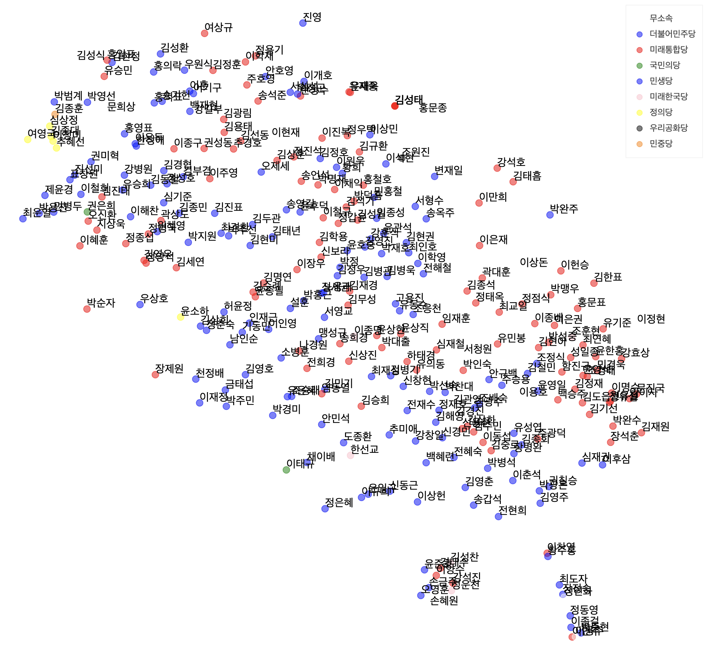
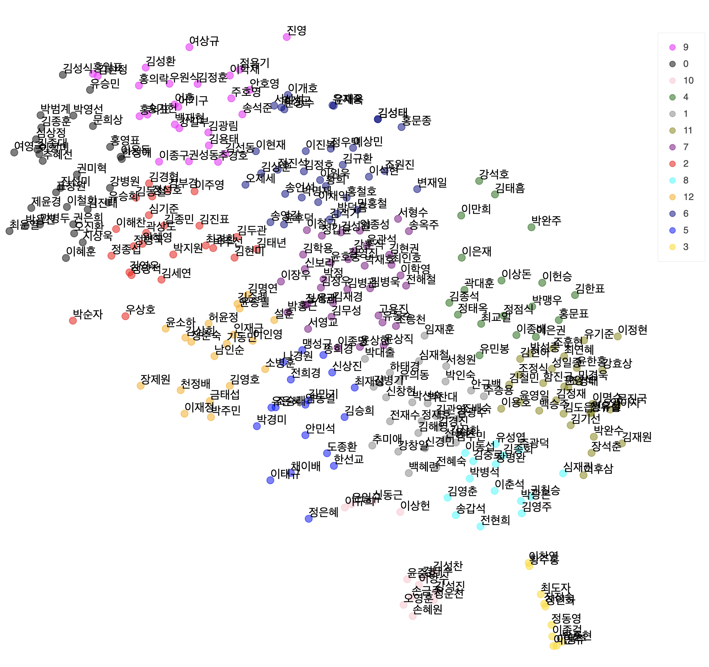
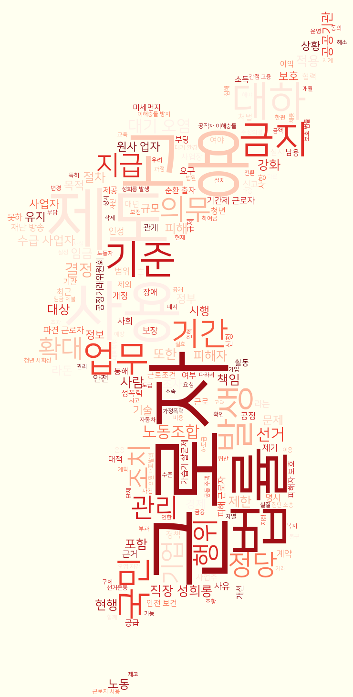
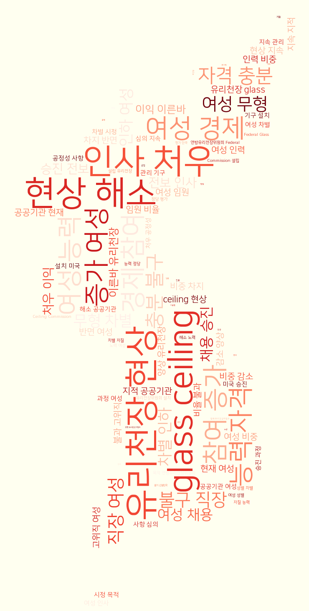
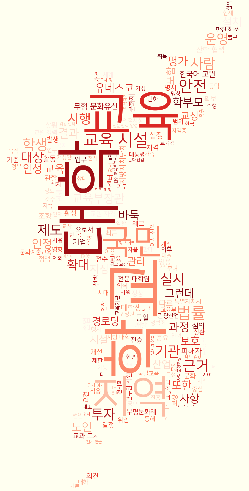

<h1 align="center" style="background-color:#00FEFE"><strong>:mag_right: 개인 맞춤 국회의원 추천시스템</strong></h3>

`#python` `#NLP` `#word2vec`

`#고등교육혁신원 사회혁신과목 장학금 수여작품 (2020)` `#데이터마이닝 최종 프로젝트 (2020)`
# 🚦 1. Abstract
- 한국품질경영학회 논문 
- 목표: 사용자의 관심사와 맞는 국회의원 추천해주기!  

- 개요: 본 프로젝트는 사용자의 관심사에 맞는 국회의원 추천을 통한 정치후원금의 활성화를 목적으로 한다.     
  배경: 2019년  정치후원금은 유권자 1인당 835원에 그쳤다. 정치후원을 하는 만큼 세액공제를 해주지만 이러한 혜택에도 참여가 저조한 실정이다. 정치후원금이 활성화되지 않는 원인이 사람들이 ‘국회의원을 잘 모르기 때문’이라고 생각했다. 국회의원이 어떠한 법안을 발의하는지, 전문 분야가 어디인지에 대한 정보를 얻기 힘들기 때문이다. 이에 이 프로젝트를 통해 국회의원들의 성격을 파악해 사용자의 관심사와 가장 잘 맞는 국회의원을 추천해주는 방법에 대해 알아보았다.     
  방법: 20대 국회에서 발의한 25,000여건의 법안, 295명의 국회의원 정보를 모아 국회의원들이 발의하는 법안의 성격을 파악해보았다. word2vec 모델을 사용하여 법안의 단어를 vector로 만든 뒤, 이를 토대로 발의 법안에 따라 국회의원 벡터를 만들었다. 이어 clustering과 word cloud를 통해 군집별로 국회의원의 성격이 얼마나 다른 지 파악해보았다. 나아가 사용자의 관심사를 Input으로 받아 그 관심사와 유사한 국회의원을 추천해주었다. 유사도가 높은 Top 5 국회의원의 이름, 정당과 그 국회의원이 발의한 법안 중 사용자 관심사가 포함된 법안들을 보여주었다. 이를 통해  정치 정보에 대한 사용자의 장벽을 낮추어 정치 후원을 활성화하고 정치참여도를 높이고자 한다.

---

# 🚦 2. 분석과정
## 2-1. 크롤링
- 법안 데이터와 국회의원 데이터가 필요하다.
- 법안 데이터는 [의안정보시스템](https://likms.assembly.go.kr/bill/main.do), 국회의원 데이터는 [열려라 국회](http://watch.peoplepower21.org/AssemblyMembers)서 크롤링했다.
- [crawler.py](https://github.com/hw79chopin/National-assembly-member-recommder/blob/master/crawler/crawler.py)에 크롤링 코드들이 있음

## 2-2. 데이터 전처리
> step 1) 법안 전처리 하기
  - 크게 법안제목과 법안내용을 합쳐준 뒤, 결측치들을 제거해주었다. (정부, 위원장이 발의하는 법안은 법안 내용이 없음)

> step 2) Tokenize
  - mecab을 사용해서 tokenized 과정을 진행해주었다.
  - 법률 용어가 mecab에 학습되어있지 않은 것이 많았기 때문에 사용자 사전을 많이 추가해주었다. (대략 2000 단어)
  - 그리고 약 2,100개의 stopwords를 추가해서 제거해주었다.
  
> step 3) Model training
  - 남은 10,000여개의 단어를 word2vec으로 vector화 시켰다.
  - 사용한 hyperparameter는 `size = 100, window = 3, min_count = 10, workers = 5, iteration = 9,000번, hs=0, sg=1`이다.
  - 학습에 19074초 걸렸다.
  
- [embedding.py](https://github.com/hw79chopin/National-assembly-member-recommder/blob/master/recommender/embedding.py) 여기 일부분이 전처리하는 코드다.

## 2-3. 국회의원 vector 생성
> step 1) 법안 vector 구하기
  - word2vec으로 구해진 단어 vector로 법안 vector를 구했다.
  - 간단하게 법안에 [사과, 바나나, 초콜렛, 미니언, 만쥬]라는 단어가 있으면 단어에 해당하는 vector를 전부 다 합쳣다.
  
> step 2) 국회의원 vector 구하기
  - 국회의원 vector는 법안 vector를 바탕으로 구했다.
  - 우선 법안 데이터에서 특정 국회의원이 발의한 모든 법안을 filtering한다.
  - filtering된 법안의 vector를 모두 더해서 국회의원의 vector를 만들었다.
 
> step 3) 결과 확인
  - 국회의원 vector가 잘 생성되었는지 확인해보기 위해서 크게 3가지 방법을 해보았다.
    - t-sne로 차원축소해 2차원으로 시각화해보기
    - clustering 후 word cloud를 만들어서 국회의원들의 관심사 파악해보기

### t-sne

- 100차원 vector를 t-sne로 2차원으로 차원축소한 뒤 시각화한 결과는 다음과 같다.
- [국회의원 네트워크 분석](https://github.com/hw79chopin/National-assembly-member-Network-anaylsis)과는 다르게 같은 당끼리 뭉쳐있는 경향이 없었다.
- 물론 정의당 의원들은 왼쪽 하단에 뭉쳐있었다. 이는 정의당 의원들이 발의하는 법안의 성격이 서로 비슷함을 의미한다.

### clustering

- 13개 cluster로 clustering 해본 뒤 시각화한 결과는 다음과 같다.  
  (차원축소 할 때마다 살짝씩 축이 달라져서 t-sne 그림과 다르게 보이지만 같은 결과를 바탕으로 만든 것이다.)
- cluster별로 의원들의 성격이 다른지 확인해보기 위해서 cluster별 의원들의 공통발의 법안을 word cloud로 만들어보았다.

### word cluod
   
- 왼쪽부터 cluster 0, cluster 3, cluster 5이다.
- cluster 0은 기간제근로자, 직장 성희롱, 근로자 권익  
  cluster 3은 여성경제, 여성인사처우 개선, 유리천장 현상 해소  
  cluster 5는 교육, 학교, 문화예술교육 등에 공통적으로 관심이 있었다.
- 이처럼 13개의 cluster 별로 word cloud를 만들어본 결과 cluster별 발의법안에 특징이 있었다.  
  (전체 word cloud 사진은 [여기](https://github.com/hw79chopin/National-assembly-member-recommder/tree/master/images))

## 2-4. 사용자 vector 생성 및 국회의원 추천
> step 1) 사용자 vector 만들기
  - 사용자 vector는 검색을 활용하여 만들도록 했다.  
  - 간단하게 사용자가 관심사를 검색창에 입력을 하면 이와 관련된 단어를 2가지 방법으로 보여줬다.
    - 첫 번째 검색결과: 검색어가 `포함된` 단어
    - 두 번재 검색결과: word2vec 학습결과를 기반으로 검색어와 `유사도`가 높은 단어
  - 이 방법을 통해 사용자가 관심사를 선택하면 이를 바탕으로 사용자 vector를 만들었다.

> step 2) 국회의원 추천하기
  - 사용자 vector와 국회의원 vector의 cosine similarity를 구해 Top 5 국회의원을 추천했다.
  - 또한 Top 5 국회의원이 발의한 법안 중에서 사용자의 관심사가 포함된 법안들도 5개씩 제시해주었다.

- 예시는 [여기](https://github.com/hw79chopin/National-assembly-member-recommder/blob/master/example.ipynb)에 들어가면 나온다.

---

# 🚦 3. 분석결과 및 개선점
- `example.ipynb`에 가면 recommender.py, embedding.py를 활용해서 직접 추천을 해보는 예시를 넣어두었다.
- word2vec 모델 말고 KoBert와 같은 문장 임베딩 모델을 사용했다면 정확도가 더 높아질 수 있을 것이다.
- 처음에는 법안 정보도 '열려라 국회'에서 크롤링했는데 여기도 '의안정보시스템'에서 크롤링 해오는거라 문자가 깨지는 등의 에러가 있었다. 또한 누락된 법안도 있었음
- 23,000여개의 법안 중에서 600개의 법안을 랜덤으로 읽고 사용자사전을 추가했는데 더 많은 법안을 보고 사용자사전을 추가했다면 embedding 품질이 더 좋아질 것이다.

---

# 🚦 4. 참고문헌
- 지주형,조희정,김순영. "디지털 소액다수 정치후원금 활성화 방안 연구" 人文論叢 VOL.47 (2018):97-124)  
- 김정도, "정치자금 소액기부의 제도 효과와 저해 요인들" 世界地域硏究論叢 VOL.29 NO.1 (2011):134-158)  
- 이윤주, "인구구조 변화에 따른 청년 사회･정치참여의 필요성 및 방안" 법과 사회 VOL.0 NO.61 (2019):29-54)  
- 이재철, "정치참여의 유형 비교: 수도권 시민의 관습적 정치참여와 비관습적 정치참여 분석" 현대정치연구 VOL.12 NO.3 (2019):35-67)  

- (더 추가될 예정)

<h3 align="center"><strong>끗! 🙌</strong></h3>
